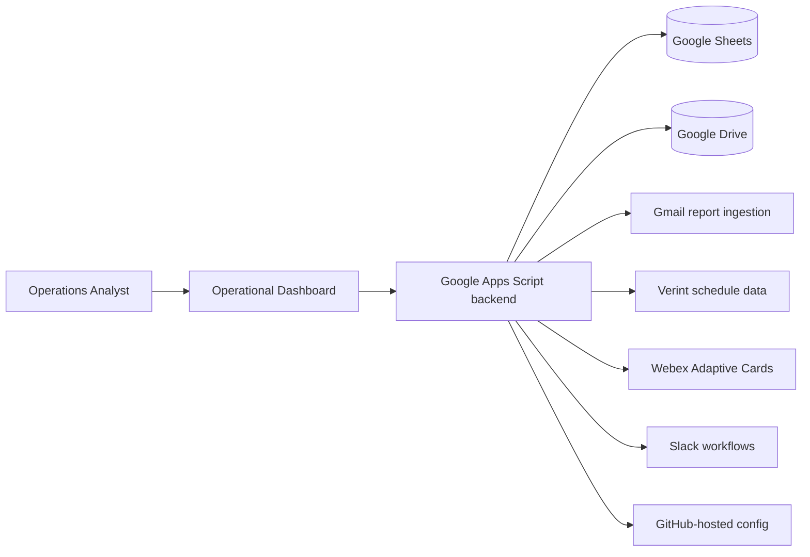

# 📊 WFM Assistant

  
  
  
  
  

> A centralized operations platform for **Workforce Management (WFM)** and
> **Real-Time Operations** teams — reporting, planning, agent lookup, AHOD
> management, and communications, in one workspace instead of ten tabs.

| 📈 At a glance | |
|---|---|
| Production deployments | **200+** |
| Development span | Multi-year, actively maintained |
| Operational modules | Reporting · Verint automation · AHOD · Agent Finder · HC planning · Outages · Communications · Webex · Gmail · Webex cards · Dashboard · Analytics |
| Integrations | Slack · Webex · Gmail · Verint · Google Sheets |
| Latest release | **v3.0.0** — Workflow Simplification Update |

## 🧭 Contents
[Problem](#-the-problem) · [Solution](#-the-solution) · [Modules](#-module-map) · [Flagship features](#-flagship-features) · [Architecture](#-architecture) · [Releases](#-release-history) · [Notice](#-confidentiality--portfolio-notice)

## 🧩 The Problem

WFM and RTA analysts live in fragmentation: intraday metrics in one tool, schedules
in Verint, approvals over Slack, agent data across spreadsheets, AHOD tracked by hand.
Every task meant switching tools, reformatting data, and hoping nothing drifted
out of sync — slow, error-prone, and dependent on who knew where things lived.

## ✅ The Solution

WFM Assistant consolidates the daily operational surface into a single interface:

- **Report once, automatically** — intraday, productivity, and shrinkage reporting
  generated from raw workforce data, no spreadsheets touched
- **Look up anyone, instantly** — agents, managers, PTO, and flex info from one search
- **Run the day** — AHOD tracking, queue flexing, HC requests, outage comms
- **Communicate in-format** — Slack/Webex-ready messages with one-click copy

## 🗺 Module Map

| Module | What it does |
|---|---|
| 📈 **Workforce Reporting Platform** | Intraday, Ultimate Report (UR) & Ultimate Report Plus (URP) — dynamic generation, XLSX export, filtering, time-unit conversion, historical analytics |
| ⚙️ **Verint Automation Suite** | Schedule import, shrinkage extraction, attendance & productivity aggregation across multiple LOBs |
| 🧮 **Workforce Analytics Engine** | Automated pipelines: aggregation, trending, daily analytics, spreadsheet population, error recovery |
| 🏠 **AHOD Management** | Activation, removal, session tracking, queue-level visibility, audit logs, live sync |
| 🔎 **Agent Finder** | Agent/manager lookup, PTO & flex visibility, workforce mapping, multi-source search |
| 📋 **HC Planning & Queue Flexing** | Queue movement announcements, capacity & buffer-HC requests, staffing comms |
| ✍️ **HC Approval Generator** | Slack-ready approvals with automatic CST / Egypt / IST time conversion & clock emoji |
| 🚨 **Outage Management** | Outage submission, time capture, impact communication, reporting support |
| 💬 **Communication Hub** | Canned responses, operational templates, one-click copy |
| 📧 **Email & File Automation** | Gmail ingestion, attachment processing, automated report imports & cleanup |
| 🤖 **Webex Automation** | Adaptive Card messaging, OOA reporting, manager summaries, team notifications |
| 🖥 **Operational Dashboard** | The single interface tying everything together |

## 🚀 Flagship Features

### Reporting Platform (UR / URP)
The largest component — automates workforce reporting end-to-end:
intraday productivity (agent / TM / LOB views), AUX hours, shrinkage,
scheduled-vs-actual, trend analysis; plus historical date-range and weekly
reporting with event & waste tracking.

### AHOD Management System
Real-time "Agent On Duty" visibility with session tracking, historical audit
logs, and live synchronization into operational workflows — coverage changes
are visible the moment they happen.

### HC Approval Generator
Turns headcount requests into formatted, timezone-aware Slack messages —
duration calculation, clock emoji, one-click copy. The little tool agents
actually thank you for.

## 🏗 Architecture

## 📜 Release History

| Version | Highlights |
|---|---|
| **v3.0.0** — Workflow Simplification | 🆕 **HC Approval Generator** (Slack-ready, CST/Egypt/IST conversion, clock emoji, one-click copy) · UI refresh & faster workflows · dashboard reorganization · improved AHOD experience · removed legacy utilities & orphanage workflow |
| **v2.5.0** — Operations Toolkit | 🆕 **AHOD Management** (session logging, queue monitoring, live sync) · **Agent Finder** (agent/manager lookup, PTO visibility) · **Communication Hub** (canned responses, templates) · outage reporting & import utilities |
| **v1.8.0** — Reporting Center | 🆕 **Intraday Reporting** (agent/TM/LOB productivity, AUX hours, shrinkage) · **Ultimate Report** (drill-down, advanced filtering, XLSX export) · **URP** (weekly reporting, event tracking, waste analysis) — transformed the app from a utility dashboard into a reporting platform |
| **v1.5.0** — Communications & Automation | 🆕 **Webex automation** (room notifications, Adaptive Cards, OOA reporting) · **Gmail processing** (automated report ingestion) · faster operational updates |
| **v1.0.0** — Initial Dashboard | Workforce operations dashboard · flex management workflows · queue movement support · communication templates · Google Sheets integration |

> The project has evolved through **200+ production deployments** — from a single
> dashboard to a full operations toolkit — guided by user feedback at every step.

## 🔮 Roadmap
In-app release notes · additional reporting dashboards · enhanced AHOD analytics ·
configurable notification center · user preference profiles · historical trend reporting

## 🔒 Confidentiality & Portfolio Notice

WFM Assistant runs in real production environments. Source code, configuration,
screenshots, internal report structures, and integration details are **intentionally
excluded** to protect company data, proprietary workflows, and compliance requirements.
This repository documents the project's functionality, evolution, architecture, and
operational impact — nothing more.

---

<b>📊 WFM Assistant</b> <i>One workspace for the whole operational day.</i>  
**Fathy Mkhimer** · Lead Real-Time Analyst · [GitHub](https://github.com/Mkhimer69)

